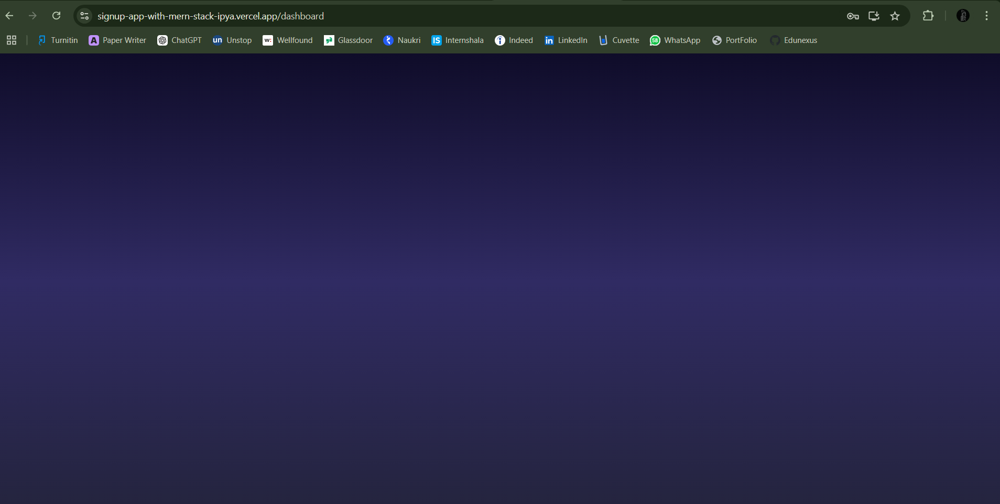

# MERN Stack Signup and Login Application

This is a simple MERN (MongoDB, Express, React, Node.js) stack application for user registration and login functionalities, featuring a secure password validation system and JSON Web Token (JWT) authentication.
## Screenshots

Here are some screenshots of the application:


_This is the signup page where users can register._


_User Successfully Signed Up._


_This is login Page._


_User Logged in Succesfully._


_Dashboard._

## Features

- **Signup**: Users can create an account by providing a username, email, and a secure password.
- **Login**: Users can log in using their username and password.
- **JWT Authentication**: Once logged in, users will receive a token for secure access to protected routes.
- **Password Validation**: Passwords must meet complexity requirements for extra security.

## Tech Stack

- **Frontend**: React.js
- **Backend**: Node.js, Express.js
- **Database**: MongoDB (MongoDB Atlas)
- **Authentication**: JWT (JSON Web Token)
- **Password Hashing**: bcrypt.js

## Prerequisites

- [Node.js](https://nodejs.org/) (version 14.x or higher)
- [MongoDB Atlas](https://www.mongodb.com/cloud/atlas) (for the database)
- [JWT Secret Key](https://jwt.io/) for secure authentication

## Setup Instructions

### 1. Clone the repository

```bash
git clone https://github.com/Kalparatna/SignupApp_With_MernStack.git
```

### 2. Backend Setup

1. Navigate to the backend directory:

```bash
cd backend
```

2. Install the dependencies:

```bash
npm install
```

3. Create a `.env` file in the root directory and add the following variables:

```bash
MONGO_URI=<Your MongoDB Atlas URI>
JWT_SECRET=<Your JWT Secret Key>
```

4. Start the backend server:

```bash
npm start
```

### 3. Frontend Setup

1. Navigate to the frontend directory:

```bash
cd frontend
```

2. Install the dependencies:

```bash
npm install
```

3. Start the React development server:

```bash
npm start
```

The application will be running at [http://localhost:3000](http://localhost:3000).

### 4. Deployment (Optional)

You can deploy the app to a platform like Vercel or Heroku. Make sure to configure your MongoDB URI and JWT secret as environment variables.

## API Routes

### 1. **POST /signup**

- **Description**: Registers a new user with a username, email, and password.
- **Request Body**: 
  - `username`: String
  - `email`: String
  - `password`: String
  - `confirmPassword`: String
- **Response**: 
  - Success: `{ success: true, message: 'User registered successfully!' }`
  - Error: `{ message: 'Password does not meet complexity requirements.' }`

### 2. **POST /login**

- **Description**: Authenticates the user and provides a JWT token.
- **Request Body**: 
  - `username`: String
  - `password`: String
- **Response**: 
  - Success: `{ success: true, token: 'JWT Token' }`
  - Error: `{ message: 'Invalid credentials' }`

### 3. **GET /users**

- **Description**: Fetches all users (without passwords).
- **Response**: 
  - `[ { username: 'user1', email: 'user1@example.com' }, { username: 'user2', email: 'user2@example.com' } ]`


## Contributing

Feel free to fork the project and submit pull requests. Make sure to write clean, modular, and well-commented code. If you find any bugs or have feature requests, please open an issue.

## License

This project is licensed under the MIT License - see the [LICENSE](LICENSE) file for details.

## Acknowledgments

- [MongoDB Atlas](https://www.mongodb.com/cloud/atlas) for the database service.
- [Express.js](https://expressjs.com/) for the backend framework.
- [React.js](https://reactjs.org/) for the frontend framework.
- [JWT](https://jwt.io/) for secure user authentication.
- [bcrypt.js](https://www.npmjs.com/package/bcrypt) for password hashing.
```

### Explanation:
1. **Images**: The images you mentioned (`1.png`, `2.png`, ..., `5.png`) are assumed to be in the `images` folder. You can replace them with actual screenshots from your project.
2. **Steps**: The README outlines how to set up both the frontend and backend, making it easier for anyone to clone and run the project.
3. **API Documentation**: It includes detailed instructions for the `/signup`, `/login`, and `/users` API routes.

### Images Folder Structure:

Make sure the images (1.png, 2.png, ...) are placed inside an `images` folder at the root of the repository:

```
/images
  1.png
  2.png
  3.png
  4.png
  5.png
```

Let me know if you need further changes!
